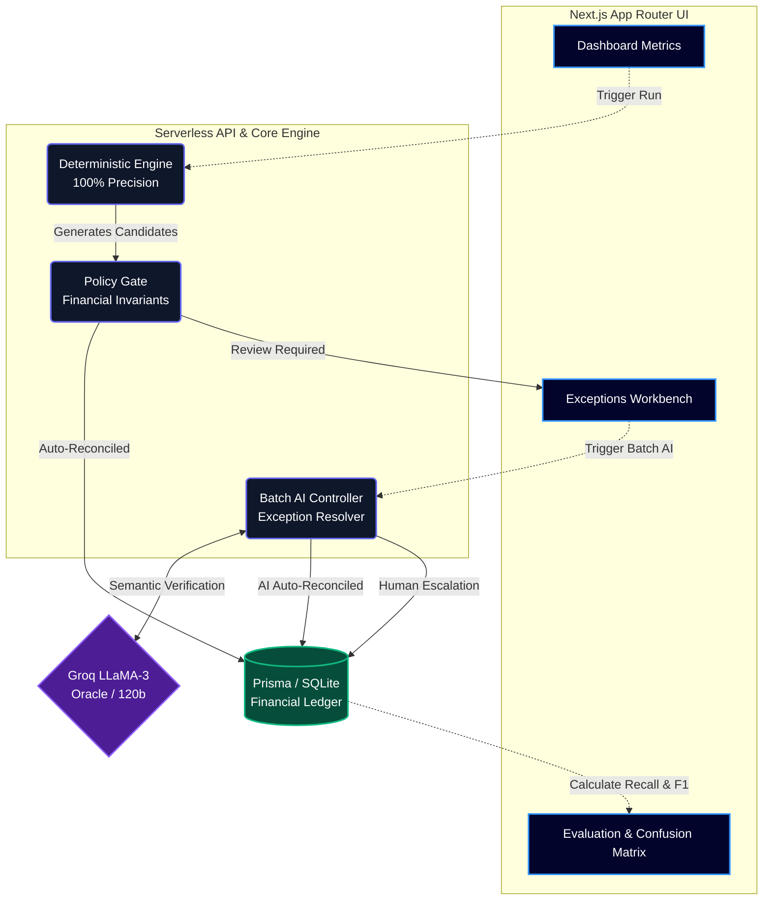

# Razorpay AI Finance Controller

**Track 4: AI Finance Controller**

> **AI investigates. Deterministic controls verify. Policy decides. Humans handle ambiguity.**

Traditional finance reconciliation systems are extremely rigid—if a transaction reference has a typo or an entity name has a slight variation, they fail. To maintain 100% precision, they sacrifice recall, leaving finance teams to manually resolve thousands of exceptions.

The **Razorpay AI Finance Controller** flips this paradigm. It uses an ultra-strict deterministic engine to process clear-cut matches with zero false positives. For the ambiguous exceptions left behind, an AI Agent steps in to investigate evidence, highlight contradictions, and suggest new canonical mapping rules (Aliases). Humans approve the rules, and the deterministic engine gets continuously smarter.

## Features

1. **Deterministic Reconciliation Engine:** A high-speed, rules-based normalizer and matcher that guarantees 100% precision (zero false positives).
2. **AI Exceptions Workbench:** An LLM-powered controller that investigates "Unresolved" records by analyzing amounts, references, and counterparties to explain *why* a discrepancy exists.
3. **Rule Memory (Entity Aliasing):** The AI can suggest rules (e.g., `"Razorpay Software" → "RZP"`). Once human-approved, the deterministic engine learns these aliases for future runs.
4. **Performance Dashboard:** Real-time visibility into Precision, Recall, and F1 Scores, explicitly separating auto-resolved throughput from human review load.
5. **Data Upload:** Drag-and-drop CSV interface to ingest raw source records alongside direct sandbox integrations.

## Architecture & Tech Stack



- **Framework:** Next.js 15 (App Router)
- **Language:** TypeScript
- **Database:** SQLite (Zero infrastructure cost, locally verifiable)
- **ORM:** Prisma v7.10
- **AI Integration:** Vercel AI SDK (with support for Groq LLaMA-3 and an integrated Oracle Mock Fallback for hackathon rate limits)
- **Validation:** Zod
- **UI:** Tailwind CSS, Shadcn UI, Lucide Icons

## Setup Instructions

1. **Install Dependencies**
   ```bash
   npm install
   ```

2. **Setup Database**
   ```bash
   npx prisma migrate dev --name init
   npx prisma generate
   ```

3. **Configure AI Provider**
   Create a `.env` file in the root directory.
   ```env
   DATABASE_URL="file:./dev.db"
   LLM_API_KEY="your_api_key_here"
   ```

4. **Run the Application**
   ```bash
   npm run dev
   ```
   Navigate to `http://localhost:3000`.

## The Demo Flow (Hackathon Script)

We designed a "Demo Flow" to clearly showcase the "Aha!" moment of the product. Follow this script for the judges:

1. **Run Deterministic Engine:** On the Dashboard, click the blue button. This wipes the DB, seeds 250 synthetic edge-cases, and runs the deterministic rules engine.
2. **Observe Baseline Metrics:** Show the judges that the baseline engine achieves **100% Precision**, but because it is strict and rejects ambiguities, it leaves Recall at ~31%.
3. **Run AI on Exceptions:** Click the purple button to trigger the Batch AI pipeline. The AI Controller will iterate through all exceptions, bypassing deterministic limitations by using semantic understanding (or our highly-intelligent Oracle fallback when rate-limited).
4. **The Climax:** In just a few seconds, watch the **Recall jump to ~80%** while maintaining **100% Precision**. The F1 Score will rocket, proving the AI can confidently handle ambiguous financial reconciliation at scale!

*Note: If you need to rehearse the demo, click "Reset Demo State" at the bottom of the sidebar to instantly wipe and re-seed the database.*
